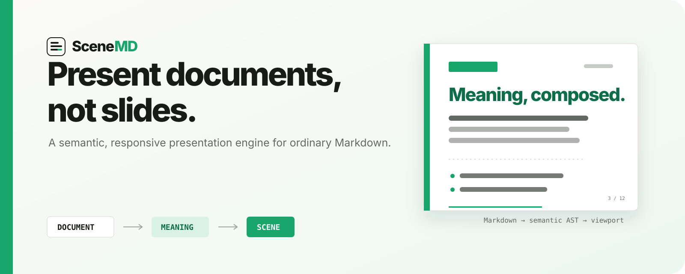

<p align="center">
  
</p>

<p align="center">
  <a href="https://github.com/htlin222/scenemd/actions/workflows/ci.yml"></a>
  <a href="LICENSE"></a>
  <a href="https://github.com/htlin222/scenemd/stargazers"></a>
  <a href="https://github.com/htlin222/scenemd/issues"></a>
  
  
  
  
  
  
  
  
</p>

# SceneMD

SceneMD is an open-source, document-first presentation engine. Write ordinary Markdown without slide delimiters; SceneMD derives semantic regions, measures the rendered content, and composes responsive presentation scenes for the current viewport.

> **Document → meaning → scene → viewport**

The canonical source remains one Markdown document. There is no generated deck to reconcile and no slide canvas to maintain.

## Why SceneMD?

Most Markdown presentation tools begin with author-defined slides. SceneMD begins with the structure and meaning already present in a document:

```text
Markdown document
      ↓
Presentation AST
      ↓
Semantic regions
      ↓
Measured pagination + scoring
      ↓
Responsive Scene[]
```

The planner prefers semantic integrity, readable typography, whitespace, and stable boundaries over maximum fill. The deterministic core never depends on an LLM.

## Features

- Ordinary GFM Markdown as the single source of truth
- Automatic heading-driven regions and measured semantic pagination
- Responsive cover, chapter, text, text-media, media-dominant, legend, and statement scenes
- Separate cover configuration for title, subtitle, series, author, date, affiliation, email, and license
- H1 chapter navigation, H2 context breadcrumbs for H3 scenes, and progress tracking
- Compact, Balanced, and Cinematic density modes
- GitHub-style Markdown authoring with Write, Split, and Preview modes
- Markdown syntax highlighting, math, tables, code, task lists, and presentation-hint autocomplete
- Marpit-compatible image sizing, filters, and scene backgrounds with a click-to-edit visual popover
- Clipboard image upload to Cloudflare R2 with immediate Markdown insertion
- Selection toolbar powered by Workers AI for prose-to-bullet conversion
- OpenEvidence conversation import and pasted TSV-to-Markdown table conversion
- Cloudflare D1 persistence and Durable Object edit coordination
- Manual two-way HackMD pull/push/smart sync through a server-side secret
- Read-only share links and Cloudflare Access protection for editing
- Fullscreen keyboard presentation, step reveals, black/white screens, dark/light themes
- Default, editorial, and Catppuccin themes in light and dark
- Speaker notes from ordinary HTML comments, with a separate presenter window
- Cursor-linked editing: the editor and the current scene follow each other
- Column groups, tabbed code groups, and per-step code highlighting
- Bracketed citations with DOI and PubMed lookup, bibliography cards, and Pandoc-compatible references
- Export to PowerPoint, PDF, slide HTML, Word, document HTML, and Markdown
- Explainable planner scores and a development debug overlay

## Quick start

Requirements: Node.js 22+, npm, and a Cloudflare account for persistence features.

```bash
git clone https://github.com/htlin222/scenemd.git
cd scenemd
npm ci
npm run dev
```

Verify a change with:

```bash
npm run typecheck
npm run build
```

The local Vite UI can run without Cloudflare services. D1, Durable Objects, R2 uploads, Workers AI, and HackMD sync require the Wrangler bindings described below.

## Write a document

```markdown
# Acute Myeloid Leukemia

AML is a clonal hematopoietic malignancy.

## Diagnosis

Diagnosis integrates morphology, immunophenotyping,
cytogenetics, and molecular genetics.

- Morphology
- Flow cytometry
- Cytogenetics
- Molecular testing


## Treatment

Treatment depends on age, fitness, disease biology,
and targetable mutations.
```

Press **Present**. H1 headings become chapter dividers; lower-level semantic regions become measured scenes. Cover metadata is configured separately, so it never pollutes the source document.

## Presentation hints

Hints are optional Markdown comments applied to the next block:

```markdown
<!-- present: break -->
<!-- present: keep -->
<!-- present: hero -->
<!-- present: hide -->
<!-- present: only -->
<!-- present: step -->
```

`present: break` is a hard boundary. `present: step` content stays in the source editor but is rendered only as an incremental reveal in presentation mode.

## Contextual editor tools

### Make bullets with Workers AI

Select prose in the CodeMirror editor and click **Make bullets**. The selected text is sent to the Worker, rewritten as a flat Markdown list, and replaced in place. The deterministic planner remains independent of the AI result.

### Format pasted tables

Paste tab-separated rows from OpenEvidence, a spreadsheet, or another web table. Select the rows—or put the cursor inside the TSV block—and click the **Sheet** toolbar icon. SceneMD escapes pipes, converts `<strong>` tags to Markdown emphasis, and repeats headers while paginating large tables by row groups.

### Edit Marpit image syntax visually

Put the cursor inside an image expression to open the image tool:

```markdown


```

The popover edits URL, alt text, dimensions, fit, filters, background side, and split size while showing a live preview. See the [Marpit image syntax reference](https://marpit.marp.app/image-syntax).

## Architecture

```text
src/engine/semantics.ts       Markdown → PresentationBlock[] → SemanticRegion[]
src/engine/planner.ts         fit test → candidate breaks → scoring → Scene[]
src/components/SceneView.tsx  responsive scene rendering
src/components/MarkdownEditor.tsx
                              CodeMirror authoring + contextual tools
functions/api/                Cloudflare Pages API boundary
worker/index.ts               Durable Object state, Workers AI, HackMD sync
```

The important boundary is `PresentationAST → Scene[]`. Markdown is the first frontend, not a permanent limitation of the planner.

## Cloudflare setup

Authenticate Wrangler and create the resources named in `wrangler.jsonc` and `worker/wrangler.jsonc`:

- D1 database: `scenemd-documents`
- R2 bucket: `scenemd-images`
- Pages project: `scenemd`
- Worker: `scenemd-live`
- Durable Object: `DocumentRoom`
- Workers AI binding: `AI`

Apply migrations and deploy:

```bash
npm run db:migrate:remote
npm run deploy
```

Store the HackMD access token as a Worker secret. Never place it in either Wrangler config file:

```bash
npx wrangler secret put HACKMD_API -c worker/wrangler.jsonc
```

For an edit-only access gate, create a Cloudflare Access application for the production hostname. Read-only links use unguessable share tokens, but you should choose an Access policy that matches your deployment’s intended sharing model.

### Image hosting model

Uploaded images are served as **capability URLs**: the path contains an unguessable UUID, anyone holding the URL can read the image, and responses are cached as immutable for a year. This is deliberate — read-only share viewers must load images without authenticating — but it means an image is only as private as its URL. Revoking a share link does not revoke images already referenced by it. Deleting a document deletes its uploaded images from R2.

## Project status

SceneMD is an early, working MVP.

Export is implemented for all six formats listed above. Note that PowerPoint and PDF export capture each scene as a raster image, so the result is faithful to what was on screen but not editable as slides — Markdown remains the canonical, editable source. Large tables paginate by row groups and repeat their header.

Still outside the current core, by design: multiplayer collaboration, WYSIWYG block editing, a slide canvas with drag positioning, AI deck generation, and animation timelines. See [the product specification](spec.md) for the full thesis and roadmap, and the [open issues](https://github.com/htlin222/scenemd/issues) for known gaps — the deterministic engine has no automated test coverage yet, which is tracked in #1 and #6.

## Contributing

Contributions are welcome. Read [CONTRIBUTING.md](CONTRIBUTING.md) before changing planner semantics, and report security issues according to [SECURITY.md](SECURITY.md).

## Citation

If you use SceneMD in research or teaching, please cite it:

```bibtex
@software{lin2026scenemd,
  author = {Lin, Hsieh-Ting},
  title = {SceneMD: A Semantic Presentation Engine for Ordinary Markdown},
  year = {2026},
  url = {https://github.com/htlin222/scenemd},
  version = {0.1.0}
}
```

<details>
<summary>AMA format</summary>

Lin HT. SceneMD: A semantic presentation engine for ordinary Markdown. Published online 2026. https://github.com/htlin222/scenemd

</details>

<details>
<summary>APA format</summary>

Lin, H.-T. (2026). *SceneMD: A semantic presentation engine for ordinary Markdown* (Version 0.1.0) [Computer software]. https://github.com/htlin222/scenemd

</details>

## License

SceneMD is released under the [MIT License](LICENSE).
